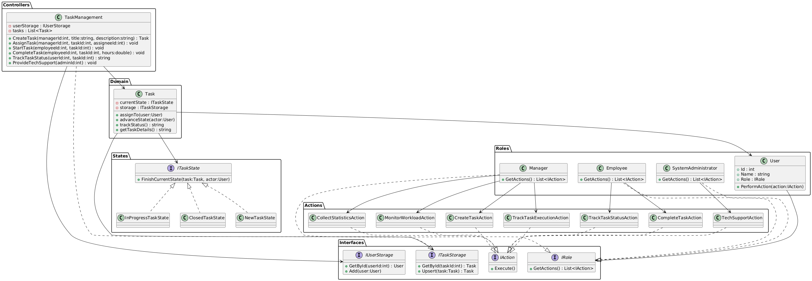
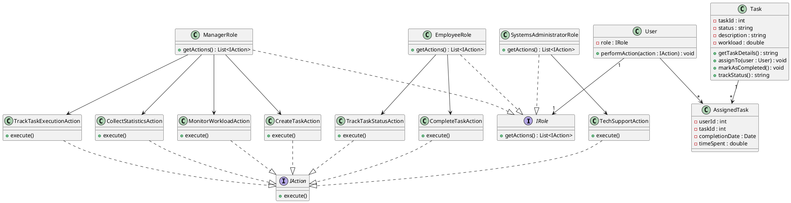

# Модель предметной области

```plantuml
@startuml
' Интерфейс для проверки доступных действий для роли
interface IRole {
+getActions() : List<IAction>
}

' Конкретные роли
class ManagerRole {
+getActions() : List<IAction>
}
class EmployeeRole {
+getActions() : List<IAction>
}
class SystemsAdministratorRole {
+getActions() : List<IAction>
}

' Конкретные роли реализуют интерфейс IRole
ManagerRole ..|> IRole
EmployeeRole ..|> IRole
SystemsAdministratorRole ..|> IRole

' Определение интерфейса для действий
interface IAction {
+execute()
}

' Конкретные действия
class CreateTaskAction {
+execute()
}
class TrackTaskExecutionAction {
+execute()
}
class CollectStatisticsAction {
+execute()
}
class TechSupportAction {
+execute()
}
class MonitorWorkloadAction {
+execute()
}
class TrackTaskStatusAction {
+execute()
}
class CompleteTaskAction {
+execute()
}

' Действия реализуют интерфейс IAction
CreateTaskAction ..|> IAction
TrackTaskExecutionAction ..|> IAction
CollectStatisticsAction ..|> IAction
TechSupportAction ..|> IAction
MonitorWorkloadAction ..|> IAction
TrackTaskStatusAction ..|> IAction
CompleteTaskAction ..|> IAction

' Пользователь
class User {
-role : IRole
+performAction(action : IAction) : void
}

' Задача
class Task {
-taskId : int
-status : string
-description : string
-workload : double
+getTaskDetails() : string
+assignTo(user : User) : void
+markAsCompleted() : void
+trackStatus() : string
}

' Промежуточная таблица для связи пользователя и задачи
class AssignedTask {
-userId : int
-taskId : int
-completionDate : Date
-timeSpent : double
}

' Связь пользователя с ролью
User "1" --> "1" IRole
User --> "*" AssignedTask

' Связь задачи с промежуточной таблицей
Task "1" --> "*" AssignedTask

' Связи ролей с действиями
ManagerRole --> CreateTaskAction
ManagerRole --> TrackTaskExecutionAction
ManagerRole --> CollectStatisticsAction
ManagerRole --> MonitorWorkloadAction

EmployeeRole --> TrackTaskStatusAction
EmployeeRole --> CompleteTaskAction

SystemsAdministratorRole --> TechSupportAction
@enduml
```
