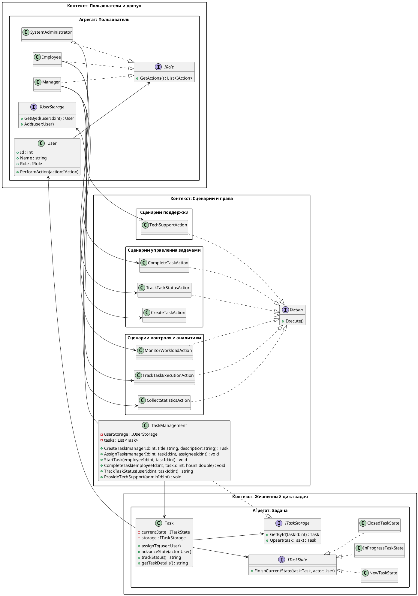

# Модель предметной области

```plantuml
@startuml
left to right direction
skinparam packageStyle rectangle

' ============================
' Контекст: Пользователи и доступ
' ============================
package "Контекст: Пользователи и доступ" {

    package "Агрегат: Пользователь" {

        interface IRole {
            +GetActions() : List<IAction>
        }

        class Manager
        class Employee
        class SystemAdministrator

        class User {
            +Id : int
            +Name : string
            +Role : IRole
            +PerformAction(action:IAction)
        }

        interface IUserStorage {
            +GetById(userId:int) : User
            +Add(user:User)
        }

        Manager ..|> IRole
        Employee ..|> IRole
        SystemAdministrator ..|> IRole
        User --> IRole
    }
}

' ============================
' Контекст: Сценарии и права
' ============================
package "Контекст: Сценарии и права" {

    interface IAction {
        +Execute()
    }

    package "Сценарии поддержки" {
        class TechSupportAction
        TechSupportAction ..|> IAction
    }

    package "Сценарии управления задачами" {
        class CreateTaskAction
        class TrackTaskStatusAction
        class CompleteTaskAction

        CreateTaskAction ..|> IAction
        TrackTaskStatusAction ..|> IAction
        CompleteTaskAction ..|> IAction
    }

    package "Сценарии контроля и аналитики" {
        class TrackTaskExecutionAction
        class CollectStatisticsAction
        class MonitorWorkloadAction

        TrackTaskExecutionAction ..|> IAction
        CollectStatisticsAction ..|> IAction
        MonitorWorkloadAction ..|> IAction
    }

    class TaskManagement {
        -userStorage : IUserStorage
        -tasks : List<Task>
        +CreateTask(managerId:int, title:string, description:string) : Task
        +AssignTask(managerId:int, taskId:int, assigneeId:int) : void
        +StartTask(employeeId:int, taskId:int) : void
        +CompleteTask(employeeId:int, taskId:int, hours:double) : void
        +TrackTaskStatus(userId:int, taskId:int) : string
        +ProvideTechSupport(adminId:int) : void
    }
}

' ============================
' Контекст: Жизненный цикл задач
' ============================
package "Контекст: Жизненный цикл задач" {

    package "Агрегат: Задача" {

        class Task {
            -currentState : ITaskState
            -storage : ITaskStorage
            +assignTo(user:User)
            +advanceState(actor:User)
            +trackStatus() : string
            +getTaskDetails() : string
        }

        interface ITaskStorage {
            +GetById(taskId:int) : Task
            +Upsert(task:Task) : Task
        }

        interface ITaskState {
            +FinishCurrentState(task:Task, actor:User)
        }

        class NewTaskState
        class InProgressTaskState
        class ClosedTaskState

        ITaskState <|.. NewTaskState
        ITaskState <|.. InProgressTaskState
        ITaskState <|.. ClosedTaskState

        Task --> ITaskState
        Task --> ITaskStorage
    }
}

' ============================
' Связи между контекстами
' ============================

TaskManagement ..|> ITaskStorage
TaskManagement --> IUserStorage
TaskManagement --> Task
Task --> User

Manager --> CreateTaskAction
Manager --> TrackTaskExecutionAction
Manager --> CollectStatisticsAction
Manager --> MonitorWorkloadAction

Employee --> TrackTaskStatusAction
Employee --> CompleteTaskAction

SystemAdministrator --> TechSupportAction
@enduml
```
