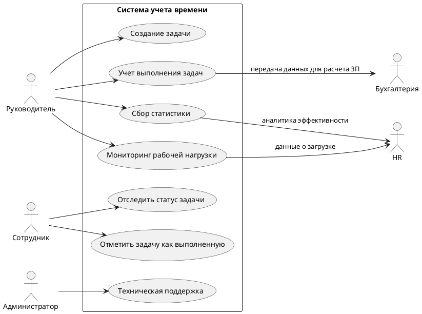

# Диаграмма прецедентов UML для системы учета рабочего времени

```plantuml
@startuml
left to right direction

actor "Руководитель" as Manager
actor "Сотрудник" as Employee
actor "Администратор" as Admin
actor "Бухгалтерия" as Accounting
actor "HR" as HR

rectangle "Система учета времени" {
    usecase "Создание задачи" as UC1
    usecase "Учет выполнения задач" as UC2
    usecase "Сбор статистики" as UC3
    usecase "Техническая поддержка" as UC4
    usecase "Мониторинг рабочей нагрузки" as UC5
    usecase "Отследить статус задачи" as UC6
    usecase "Отметить задачу как выполненную" as UC7
}

Manager --> UC1
Manager --> UC3
Manager --> UC5
Manager --> UC2
Employee --> UC6
Employee --> UC7
Admin --> UC4

UC2 --> Accounting : передача данных для расчета ЗП
UC3 --> HR : аналитика эффективности
UC5 --> HR : данные о загрузке

@enduml
```
