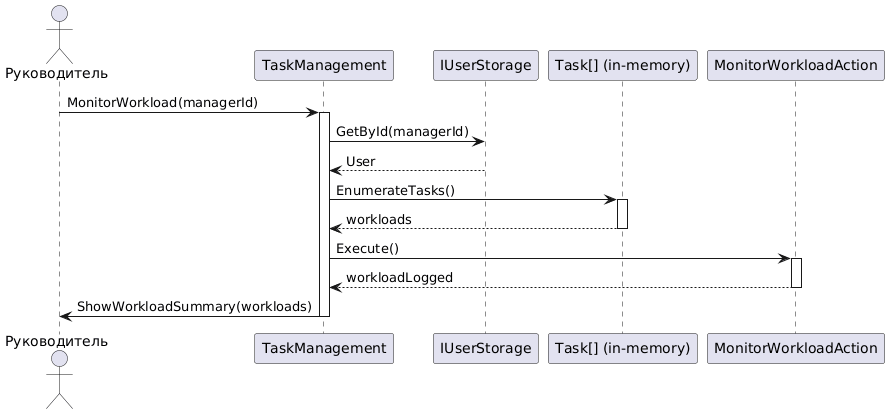

# Диаграмма последовательностей UML для сценария "Мониторинг рабочей нагрузки"


```
@startuml
actor "Руководитель" as Manager
participant "TaskManagement" as Controller
participant "IUserStorage" as UserStorage
participant "Task[] (in-memory)" as TaskArray
participant "MonitorWorkloadAction" as Action

Manager -> Controller: MonitorWorkload(managerId)
activate Controller

Controller -> UserStorage: GetById(managerId)
UserStorage --> Controller: User

Controller -> TaskArray: EnumerateTasks()
activate TaskArray
TaskArray --> Controller: workloads
deactivate TaskArray

Controller -> Action: Execute()
activate Action
Action --> Controller: workloadLogged
deactivate Action

Controller -> Manager: ShowWorkloadSummary(workloads)
deactivate Controller
@enduml
```


