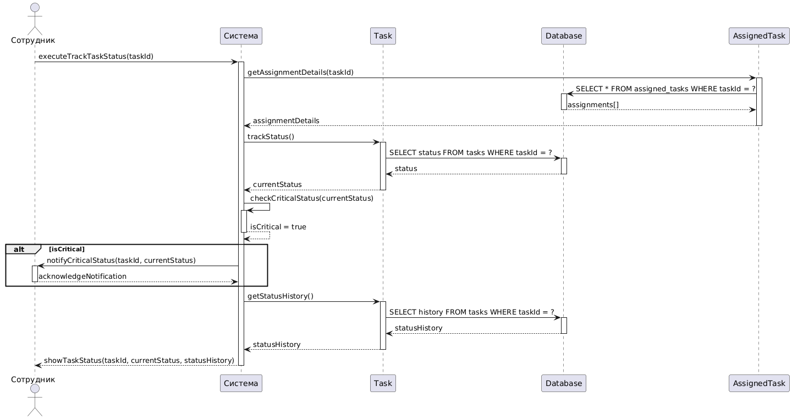

# Диаграмма последовательностей UML для сценария "Отслеживание статуса задачи"


```
@startuml
actor "Сотрудник" as Employee
participant "TaskManagement" as Controller
participant "IUserStorage" as UserStorage
participant "Task" as TaskObj
participant "ITaskState" as State

Employee -> Controller: TrackTaskStatus(employeeId, taskId)
activate Controller

Controller -> UserStorage: GetById(employeeId)
activate UserStorage
UserStorage --> Controller: User
deactivate UserStorage

Controller -> TaskObj: GetById(taskId)
activate TaskObj
TaskObj -> State: trackStatus()
State --> TaskObj: статус/название
TaskObj --> Controller: status
deactivate TaskObj

Controller -> Employee: ShowStatus(status)
deactivate Controller
@enduml
```