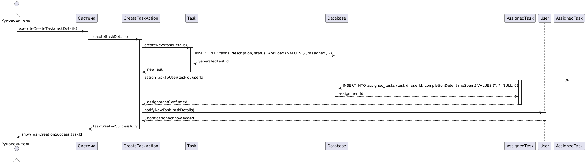

# Диаграмма последовательностей UML для сценария "Создание задачи"

@startuml
actor "Руководитель" as Manager
participant "Система" as System
participant "CreateTaskAction" as CreateAction
participant "Task" as TaskObj
participant "Database" as DB
participant "AssignedTask" as AssignedObj
participant "User" as Employee

Manager -> System: executeCreateTask(taskDetails)
activate System

System -> CreateAction: execute(taskDetails)
activate CreateAction

CreateAction -> TaskObj: createNew(taskDetails)
activate TaskObj

TaskObj -> DB: INSERT INTO tasks (description, status, workload) VALUES (?, 'assigned', ?)
activate DB
DB --> TaskObj: generatedTaskId
deactivate DB

TaskObj --> CreateAction: newTask
deactivate TaskObj

CreateAction -> AssignedTask: assignTaskToUser(taskId, userId)
activate AssignedObj

AssignedObj -> DB: INSERT INTO assigned_tasks (taskId, userId, completionDate, timeSpent) VALUES (?, ?, NULL, 0)
activate DB
DB --> AssignedObj: assignmentId
deactivate DB

AssignedObj --> CreateAction: assignmentConfirmed
deactivate AssignedObj

CreateAction -> Employee: notifyNewTask(taskDetails)
activate Employee
Employee --> CreateAction: notificationAcknowledged
deactivate Employee

CreateAction --> System: taskCreatedSuccessfully
deactivate CreateAction

System --> Manager: showTaskCreationSuccess(taskId)
deactivate System

@enduml
