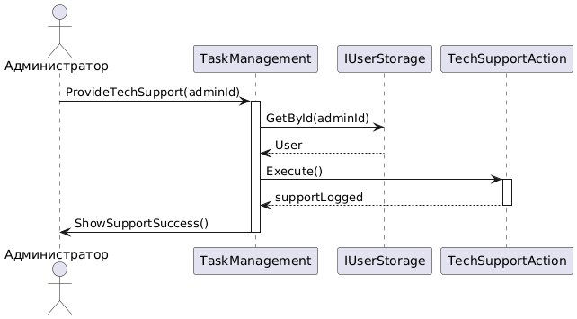

```
@startuml
actor "Администратор" as Admin
participant "Система" as System
participant "Task" as TaskObj
participant "Database" as DB
participant "AssignedTask" as AssignedObj
participant "User" as SupportedUser

Admin -> System: executeTechSupport(taskId)
activate System

System -> TaskObj: getTaskDetails(taskId)
activate TaskObj
TaskObj -> DB: SELECT * FROM tasks WHERE taskId = ?
activate DB
DB --> TaskObj: task
deactivate DB
TaskObj --> System: taskDetails
deactivate TaskObj

System -> AssignedObj: getAssignmentDetails(taskId)
activate AssignedObj
AssignedObj -> DB: SELECT * FROM assigned_tasks WHERE taskId = ?
activate DB
DB --> AssignedObj: assignments[]
deactivate DB
AssignedObj --> System: assignmentDetails
deactivate AssignedObj

System -> SupportedUser: performAction(provideSupport(taskDetails))
activate SupportedUser
SupportedUser --> System: supportReceived
deactivate SupportedUser

System -> TaskObj: trackStatus(supportProvided)
activate TaskObj
TaskObj --> System: updatedStatus
deactivate TaskObj

System --> Admin: showSupportSuccess(taskId)
deactivate System

@enduml
```