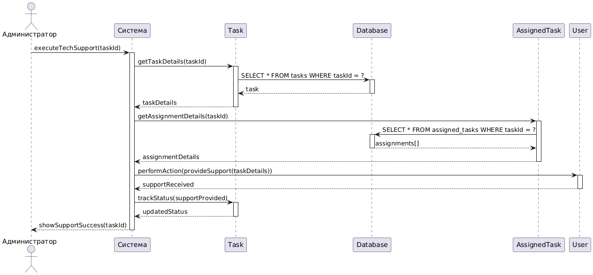

```
@startuml
actor "Администратор" as Admin
participant "TaskManagement" as Controller
participant "IUserStorage" as UserStorage
participant "TechSupportAction" as Action

Admin -> Controller: ProvideTechSupport(adminId)
activate Controller

Controller -> UserStorage: GetById(adminId)
UserStorage --> Controller: User

Controller -> Action: Execute()
activate Action
Action --> Controller: supportLogged
deactivate Action

Controller -> Admin: ShowSupportSuccess()
deactivate Controller
@enduml
```