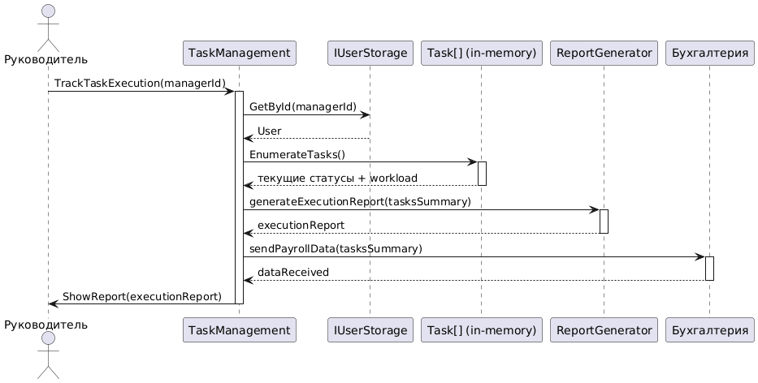

# Диаграмма последовательностей UML для сценария "Учет выполения задач"


```
@startuml
actor "Руководитель" as Manager
participant "Система" as System
participant "TaskManager" as TaskManager
participant "Database" as DB
participant "ReportGenerator" as ReportGen
participant "Бухгалтерия" as Accounting

Manager -> System: executeTrackTaskExecution()
activate System

System -> TaskManager: getTaskList()
activate TaskManager
TaskManager -> DB: SELECT * FROM tasks
activate DB
DB --> TaskManager: tasks[]
deactivate DB
TaskManager --> System: taskList
deactivate TaskManager

System -> TaskManager: getAssignmentData()
activate TaskManager
TaskManager -> DB: SELECT * FROM assigned_tasks
activate DB
DB --> TaskManager: assignments[]
deactivate DB
TaskManager --> System: assignmentData
deactivate TaskManager

System -> TaskManager: calculateWorkloadStats()
activate TaskManager
TaskManager -> TaskManager: analyzeTimeSpent(taskList, assignmentData)
TaskManager --> System: workloadStatistics
deactivate TaskManager

System -> ReportGenerator: generateExecutionReport(taskList, assignmentData, workloadStatistics)
activate ReportGen
ReportGen --> System: executionReport
deactivate ReportGen

System -> Accounting: sendPayrollData(assignmentData, workloadStatistics)
activate Accounting
Accounting --> System: dataReceived
deactivate Accounting

System --> Manager: showReport(executionReport)
deactivate System

@enduml
```